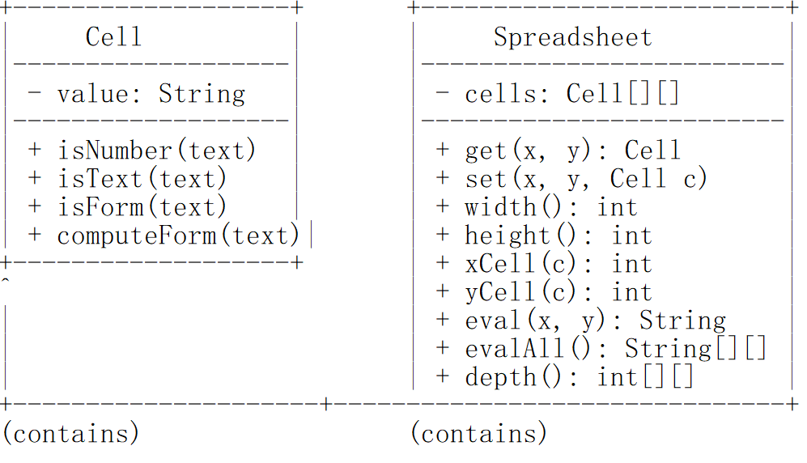
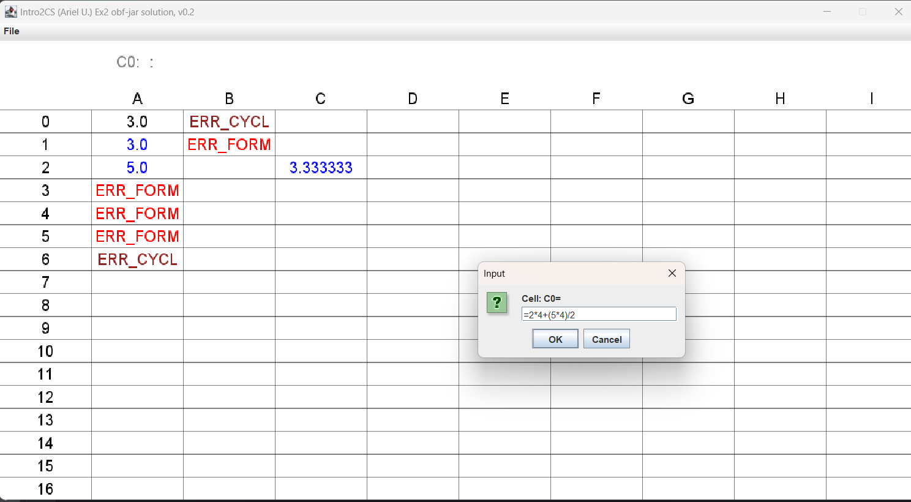

# first part:
## Ex2: Foundations of Object-Oriented and Recursion
### Introduction
This project focuses on building a basic version of a 
**Spreadsheet**, designed to enhance understanding of:
- Object-Oriented Design principles.
- Recursive problem solving.
- Algorithmic thinking for dependencies and cycles.

### Class Diagram: Cell and Spreadsheet

The following diagram shows the relationship between the `Cell` class and the `Spreadsheet` class.


# Second part:
# Ex2: Foundations of Object-Oriented and Recursion

## Introduction
This project focuses on building a basic version of a **Spreadsheet**, designed to enhance understanding of:
- Object-Oriented Design principles.
- Recursive problem solving.
- Algorithmic thinking for dependencies and cycles.

### Class Diagram: Cell and Spreadsheet
The following diagram shows the relationship between the `Cell` class and the `Spreadsheet` class:


---
# Second part

# Spreadsheet Application

## Introduction
This project implements a basic version of a **Spreadsheet** in Java, designed to enhance understanding of:
- Object-Oriented Design principles
- Recursive problem solving
- Algorithmic thinking for dependencies and cycles

## Features

### Cell Types
- **Text**: Plain text content
- **Numbers**: Numeric values
- **Formulas**: Mathematical expressions starting with '=' that can:
    - Reference other cells (e.g., A1, B2)
    - Perform arithmetic operations (+, -, *, /)
    - Handle parentheses for operation precedence
    - Support cell dependencies and automatic updates

### Error Handling
- `ERR_FORM`: Reports invalid formula formats
- `ERR_CYCL`: Detects and reports circular references
- Validates cell references and mathematical expressions
- Gracefully handles malformed data

### Core Functionality
- Dynamic cell evaluation
- Dependency tracking
- File I/O operations (save/load)
- Console-based display

## Class Structure

### `Ex2Sheet` (Main Spreadsheet Class)
- Manages the grid of cells
- Handles spreadsheet operations
- Implements file I/O
- Evaluates formulas
- Manages cell dependencies

### `SCell` (Cell Implementation)
- Stores cell content and computed values
- Evaluates formulas
- Tracks cell dependencies
- Detects circular references

## Usage Examples

### Creating a Spreadsheet
```java
// Create a 10x10 spreadsheet
Ex2Sheet sheet = new Ex2Sheet(10, 10);
```

### Setting Cell Values
```java
// Set numeric value
sheet.set(0, 0, "123");       // A1 = 123

// Set formula
sheet.set(1, 1, "=A1 + 50");  // B2 = A1 + 50

// Set text
sheet.set(2, 2, "Total:");    // C3 = Total:
```

### Reading Cell Values
```java
String value = sheet.value(1, 1);  // Get value of cell B2
```

### File Operations
```java
// Load from file
sheet.load("data.csv");

// Save to file
sheet.save("output.csv");

// Display spreadsheet
sheet.printSheet();
```

### Complete Example
```java
public class Main {
    public static void main(String[] args) {
        Ex2Sheet sheet = new Ex2Sheet(5, 5);
        
        // Set initial values
        sheet.set(0, 0, "100");        // A1 = 100
        sheet.set(1, 1, "=A1 + 50");   // B2 = A1 + 50
        sheet.set(2, 2, "=B2 * 2");    // C3 = B2 * 2
        
        // Display results
        sheet.printSheet();
    }
}
```

## Formula Syntax

### Valid Formulas
- `=1`
- `=1.2`
- `=(0.2)`
- `=1+2`
- `=1+2*3`
- `=(1+2)*((3))-1`
- `=A1`
- `=A2+3`
- `=(2+A3)/A2`

### Invalid Formulas (Result in ERR_FORM)
- `a`
- `AB`
- `@2`
- `2+)`
- `(3+1*2)-`
- `=()`
- `=5**`

### Circular References (Result in ERR_CYCL)
Any formula that references itself directly or indirectly, e.g., A1 referencing A1

## File Format
The spreadsheet uses CSV format with the following structure:
```
x,y,value
```
Where:
- `x`: Column index (0-based)
- `y`: Row index (0-based)
- `value`: Cell content (number, text, or formula)

## Requirements
- Java SE Development Kit (JDK)
- No additional libraries required

## Notes
- All formulas must start with '='
- Cell references are case-insensitive
- Numbers can be integers or decimals
- Empty cells are treated as text cells

